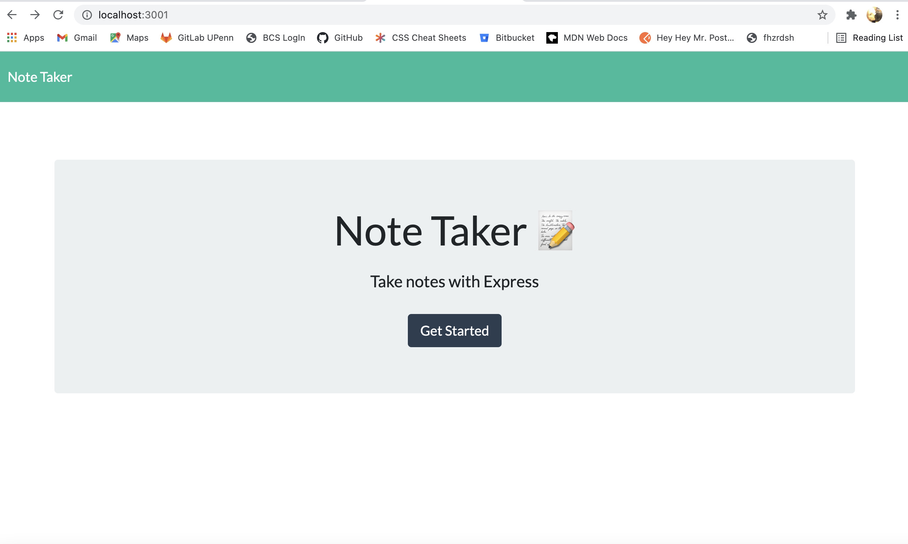
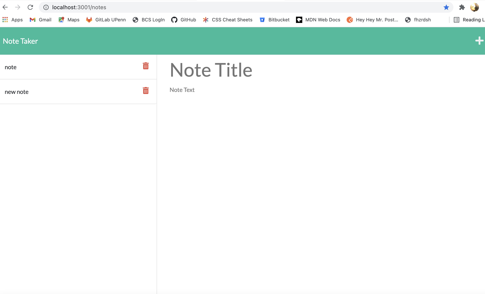

# Cat's Note-Taker
## Table of Contents
* [description](#description)
* [installation](#installation)
* [methods](#methods)
* [contributions](#contributions)
* [testing](#testing)
* [license](#license)
* [contact](#contact)


## Description
> This project was to modify starter code and create an application called Note Taker that can be used to write and save notes. This application will use an ```Express.js```  back end and will save and retrieve note data from a JSON file.

The application’s front end was already created. It's was my job to build the back end, connect the two, and then deploy the entire application to Heroku.  I was able to connect the front end to the back end havd the db.json file read on the html page, however the saved note postion of the assignment proved difficult and after 30+ hours of failed trial and error.  Two different tutoring sessions, with no relief of why it would not result in anything other than undefined.  I have decided to turn this in, and attempt to ask my TAs or Teacher for assistance after the due date to maybe get a better understanding of why this did not work, since my tutor did not know, nor did my class mates after having them take a look. 



[Heroku-Page]()

>
## Installation
> I pulled the [npm](https://www.npmjs.com/) package, aka ```package.json```, entered ```npm i```. I also installed ```uuid``` to create a unique id for each note. 
## Methods
> * node 
> * ```fs.writeFile```  promises 
> * uuid package 
> * [Shields IO](https://shields.io/category/license) 
> * [Open Source Initiative](https://opensource.org/licenses/BSD-3-Clause) 
## Contributions
>
## Testing
> 
## License

Copyright (C) 2021 catupperman

        This program is free software: you can redistribute it and/or modify
        it under the terms of the GNU General Public License as published by
        the Free Software Foundation, either version 3 of the License, or
        (at your option) any later version.
        
        This program is distributed in the hope that it will be useful,
        but WITHOUT ANY WARRANTY; without even the implied warranty of
        MERCHANTABILITY or FITNESS FOR A PARTICULAR PURPOSE.  See the
        GNU General Public License for more details.
        
        You should have received a copy of the GNU General Public License
        along with this program.  If not, see <http://www.gnu.org/licenses/>.
## Contact
* [GitHub](github.com/catupperman)
* email:  catupperman@gmail.com
* Prefered Contact: Email